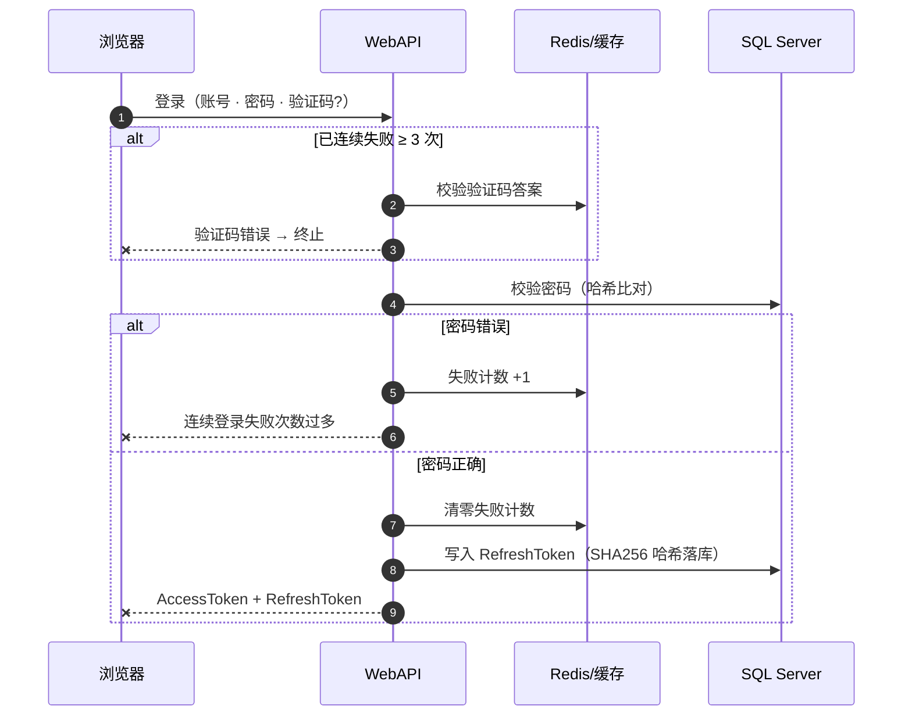
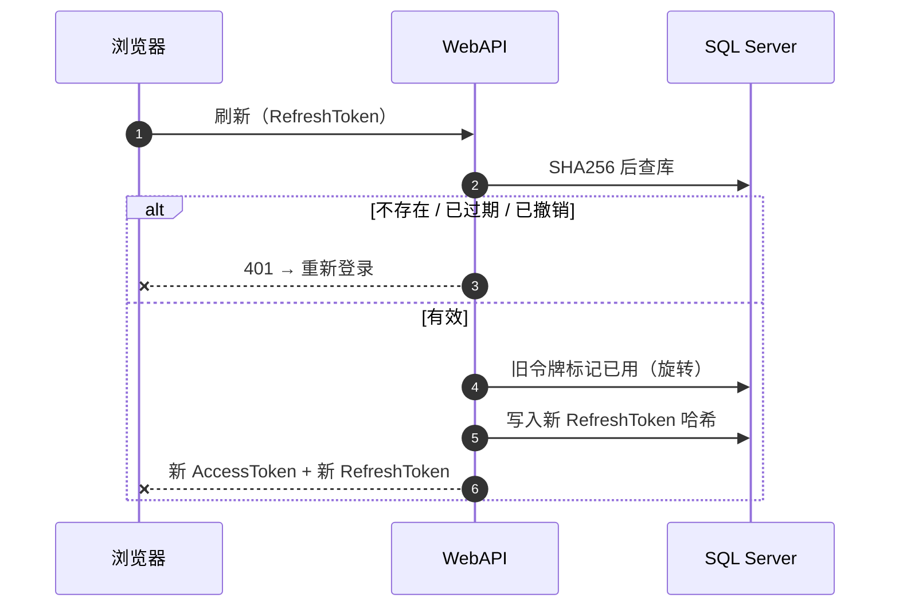
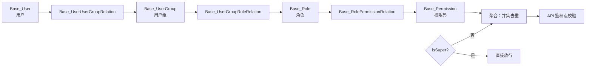

# 认证与授权

## 登录流程

失败计数达到阈值（3 次）后强制验证码，防止在线爆破：

要点：

- **RefreshToken 落库只存 SHA256 哈希**——库被拖也无法重放令牌
- 密码错误与验证码错误的文案**不泄露对方哪一步失败**
- 失败计数按用户名隔离，成功登录即清零

## 刷新令牌

- **旋转语义**：每次刷新签发新 RefreshToken，旧的立即作废
- **连坐撤销**：修改密码等敏感操作会撤销该用户全部 RefreshToken

## 权限聚合

权限 = 用户所有用户组下挂角色的权限并集；`super` 超级管理员短路放行：

- 权限码挂角色，角色挂用户组，用户进组——**用户不直接挂角色**，便于批量授权
- 聚合结果做去重，避免多组重叠权限重复计数
- 测试覆盖：组间传递、并集去重、super 放行（`UserPermissionTests`，8 例）
