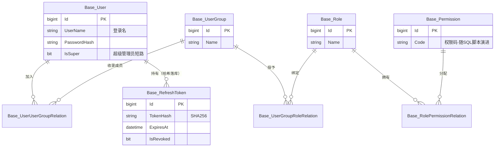
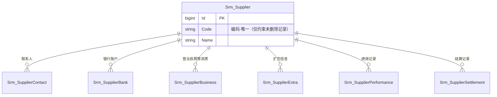
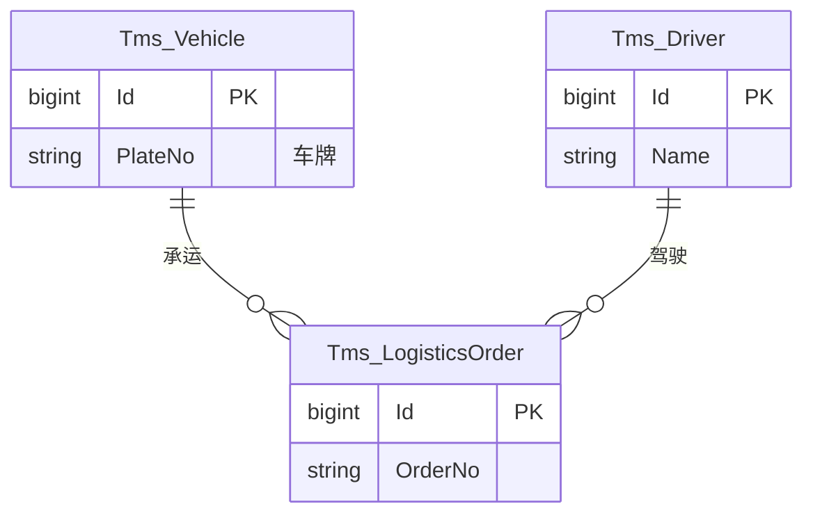

# 数据模型

24 张表 = 基础平台 `Base_*` 13 张 + 供应商 `Srm_*` 7 张 + 运输 `Tms_*` 3 张 + 刷新令牌 1 张。所有表统一软删除三件套（`IsDeleted` / `DeletedAt` / `DeletedBy`）与 YitId 主键。

## 权限体系（RBAC）

## 供应商（SRM）

主表 + 六张子表，子表全部以 `SupplierId` 回联主表：

- 供应商编码唯一索引带软删除过滤：删除重建同编码不冲突
- `BatchSaveAsync` 是**更新语义**：按 `Id` 找不到即抛「供应商不存在」

## 运输（TMS）

## 基础平台其余各表

| 表 | 用途 |
| --- | --- |
| `Base_DictType` / `Base_DictItem` | 字典两件套，类型约束取值 |
| `Base_File` | 附件元数据 |
| `Base_NumberRule` | 单据编号规则 |
| `Base_OperationLog` | 操作日志（带索引与清理策略） |
| `Base_AppClient` | 接入客户端注册 |

## MS_Description 约定

数据库列描述 = 实体 XML 注释 `summary` **首行**（`db/gen-descriptions.ps1` 生成）：

- 首行：简洁名词短语，不带句号、不重复表名
- 引用其它表必须写 `<para>`（首行 `<see>` 会被生成器清空）
- 字典引用统一「字典 xxx」格式；枚举含义统一「0xx 1xx」
