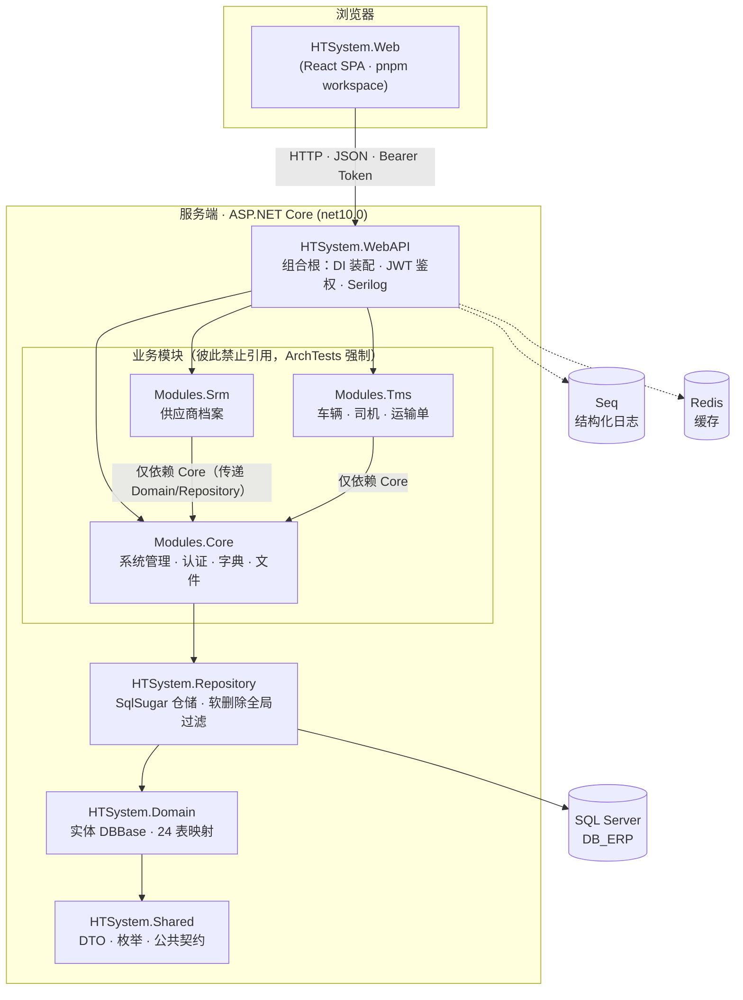
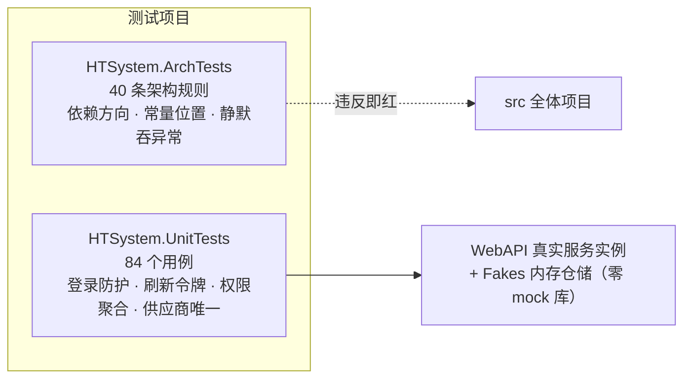

# 模块与代码结构

[总体架构](overall.md)讲分层与原则，本文讲它们**在代码仓库里的真实形状**——项目怎么切、依赖怎么指、由什么机制锁住。

## 代码结构图



## 依赖规则（为什么这样切）

| 规则 | 目的 |
| --- | --- |
| 模块之间禁止互相引用 | Srm/Tms 互不知晓，未来可拆独立服务 |
| Srm/Tms 只依赖 Modules.Core | 公共能力（认证、字典、仓储）下沉 Core，一处维护 |
| 实体只在 Domain，仓储统一入口 | 模块不直接摸 SqlSugar，软删除过滤在仓储层统一生效 |
| 控制器住在各模块内（ApplicationPart 注册） | 加模块不用改宿主代码 |
| WebAPI 只做组合根 | 模块装配与业务逻辑彻底分离 |

## 测试守卫体系

架构不是靠约定，是靠测试锁住的：



- **ArchTests**：`dotnet test` 里跑架构规则，任何人写出违规依赖，CI 直接挂
- **UnitTests**：不起 mock 库，用真实服务实例 + 手写内存 Fake 仓储；YitId 雪花 ID 初始化用 `lock` 双检保证并行安全

## 基础设施约定

- **ID**：YitId 雪花 ID（趋势递增，不暴露业务计数）
- **软删除**：全表统一三件套 `IsDeleted / DeletedAt / DeletedBy`，仓储层全局过滤，唯一索引均带未删除过滤条件
- **日志**：Serilog 异步写 Seq，环境与线程 Enricher 齐全
- **权限码**：随 SQL 脚本演进（见 `sql/` 目录权限节点脚本）

## 目录速查

```
src/
├── HTSystem.WebAPI/        # 组合根（唯一可执行入口）
├── HTSystem.Modules.Core/  # 系统管理域（认证/字典/文件/审计）
├── HTSystem.Modules.Srm/   # 供应商域
├── HTSystem.Modules.Tms/   # 运输域
├── HTSystem.Application/   # ⚠ 历史残留（仅 obj/，待清理）
├── HTSystem.Core/          # ⚠ 历史残留（仅 obj/，待清理）
├── HTSystem.Repository/    # 仓储层
├── HTSystem.Domain/        # 实体层
├── HTSystem.Shared/        # 公共契约
├── HTSystem.Web/           # React 前端
├── HTSystem.UnitTests/     # 单元测试
├── HTSystem.ArchTests/     # 架构守卫测试
└── db/                     # 描述生成器 + 幂等 SQL 脚本
```
