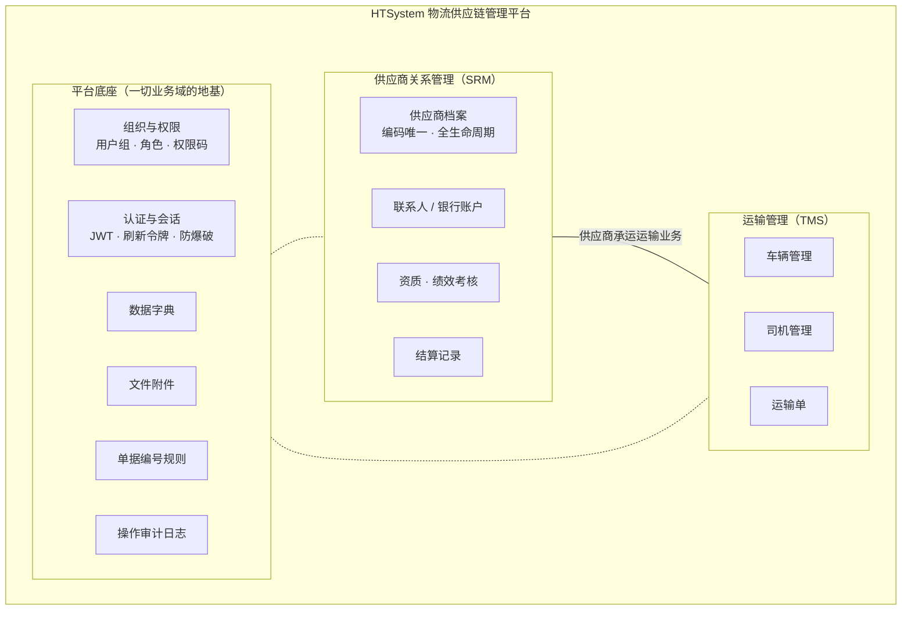
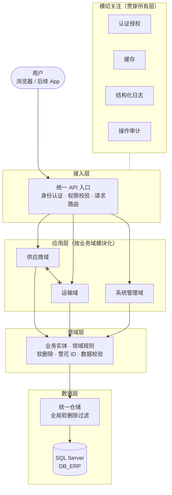
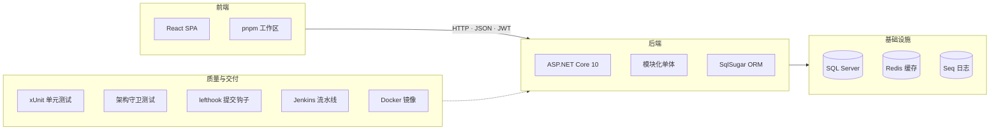
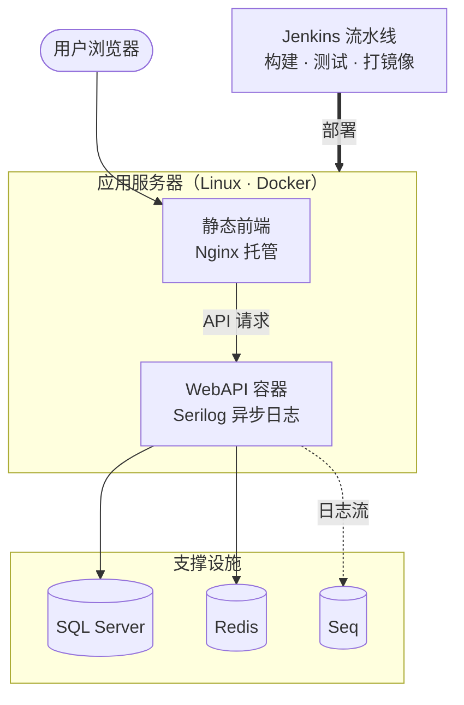

# 总体架构

HTSystem 是**物流供应链管理平台**：模块化单体架构，业务域彼此隔离，底座能力统一供给。本文自上而下用四张图描述系统——业务看能力、架构看分层、技术看选型、运维看部署。

**四条架构总原则**

1. **模块化单体**：域与域之间零依赖，任何域未来可独立拆出
2. **底座下沉**：认证、字典、文件、审计等公共能力由平台底座统一提供
3. **数据同源**：所有表描述由实体注释生成，文档与代码永不脱节
4. **架构即测试**：架构规则不是文档约定，是会挂 CI 的自动化测试

---

## 业务架构 · 能力地图

对外呈现的业务能力，非技术人也能看懂：

> SRM 与 TMS 通过业务数据（供应商承运）关联，但**代码上互不知晓**——这是模块化的核心价值。

## 应用架构 · 分层视角

经典分层 + 模块化拆分，请求自上而下流动：

> 图中 `x---x` 表示**禁止依赖**：域与域之间只能通过底座共享能力协作。

## 技术架构 · 技术栈全景

| 层 | 选型 | 一句话理由 |
| --- | --- | --- |
| 前端 | React SPA | 组件化 + 生态成熟，后续移动端可复用接口层 |
| 后端 | ASP.NET Core 10 | 模块化单体能吃到单体开发效率，又保留拆分余地 |
| ORM | SqlSugar | 仓储模式封装，软删除全局过滤一处生效 |
| 主键 | YitId 雪花 ID | 趋势递增、分库友好、不暴露业务计数 |
| 缓存 | Redis | 登录防护计数、热点字典 |
| 日志 | Serilog → Seq | 结构化查询，异步写入不拖请求 |
| 数据库 | SQL Server | 过滤索引支撑「唯一 + 软删除」并存 |

## 部署架构

> 质量门禁在流水线上：架构守卫测试不过 → 不出镜像；单元测试不过 → 不部署。

---

## 从抽象到代码

| 想了解 | 去哪 |
| --- | --- |
| 分层怎么落到具体项目与依赖规则 | [模块与代码结构](modules.md) |
| 登录、令牌、权限的完整流程 | [认证与授权](auth.md) |
| 24 张表的关系与设计约定 | [数据模型](data-model.md) |
